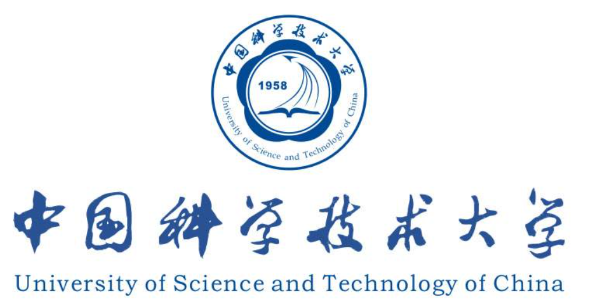
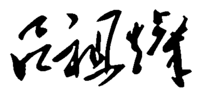

  
My name is Zucan Lv ( 吕祖灿 ), a 2nd-year undergraduate student majoring in CS @USTC. I'm currently learning Multi-agent System and Deep Learning.

  

    
    
  

<!-- ## 🎖️Scholarships and Honors
+ 
+ Freshman Scholarship of USTC -->

# :call_me_hand: Contact with me!

- :mailbox: **Email:** [zucanlv@mail.ustc.edu.cn](mailto:zucanlv@mail.ustc.edu.cn)

- :iphone: **Cell Phone:** (+86) 138 8368 3854

- :penguin: **QQ Number:** 2407409322

- :cn: **Contact Address:** University of Science and Technology of China, Baohe Distinct, Hefei, Anhui, China.
